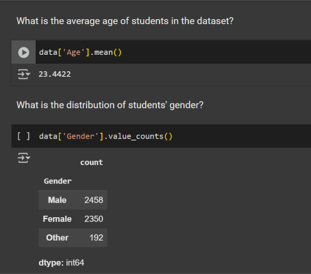

# AI-ML 

## Assignment No - 1

**Take a usecase in any domain and explain below points properly**
- Data : Data Sources, Data Issues, Types of Data
- Problem Statement

## Assignment No - 2

**Use Methods of Python Datatypes (Objects)**
*int, float, complex, list, tuple, str, set, dict, bool*   
Hint: `help()`  
Notebook Link : [Click Here](https://colab.research.google.com/drive/18HsJ_XkzEfcE0WzCnIAi8WZzLOWdgQHa?usp=sharing)

## Assignment No - 3

**Python Libraries for Data Analysis and Visualization**
- [Numpy-100](https://github.com/rougier/numpy-100/blob/master/100_Numpy_exercises.ipynb) , Solve using `help(np)` and `help(np.function_name)` .
- [Pandas-100](https://github.com/ajcr/100-pandas-puzzles/blob/master/100-pandas-puzzles.ipynb) , Solve using `help(pd)` and `help(pd.function_name)` .
- Matplotlib : Draw 10 graphs with proper meaning
- Seaborn : Draw 10 graphs with proper meaning

## Assignment No - 4

**Take any Dataset from Kaggle, [data.gov.in](https://www.data.gov.in/), [data.gov](https://data.gov/), etc**  
Diplay the first 5 rows of the data using pandas. Copy it.

Prompt:  
*This is a sample dataset. My complete data shape is `data.shape`.* 
> Insert your 5 rows here.
> 
> 
*Give me 100 real world questions based on my data which I can solve using Numpy, Pandas, Matplotlib, Seaborn.*

Now, use that questions and solve in Jupyter notebook using the dataset.  

Reference: 

## Assignment No - 5

**Implementing Multiple ML Algorithmns**
- Simple LR, Multiple LR
- Logistic
- Decision Tree Regressor, Decision Tree Claassifier
- Random Forest
- Naive Bayes
- SVC
- XGBoost

`Note: Only one colab Notebook per assignment`
